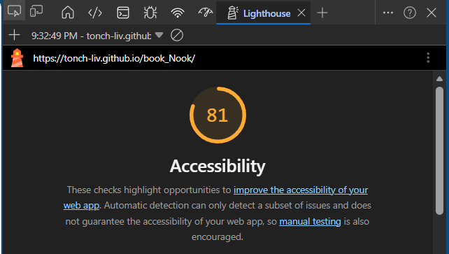
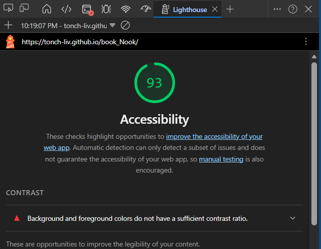

# book_Nook

log and track books + reviews / vote and display chart

Place for users to log and track books read.
Share reviews and/or find recommendations.  
Maybe include voting and chart (big MAYBE).

A = Team Leader Antonio  
B = Team Member Antonio  
C = Team Supervisor Antonio  
D = Consigliere Antonio  

## User Stories

As an avid reader, I'd like to keep track of what books I've read, so that I may keep record, provide a rating and review, as well as let other users share and rate books they've read and let them discover new books.

### Feature Tasks

- Create a site layout w/ a banner with a title and bookcase/library design elements. (done, day 1, 03.31, (B))
- Create table to track books with pertaining info off wireframe (author last and first, book name, genre, pages, rating, added by whom). (done, day 1, 03.31, (B))
- Create form to allow additions to table of new books.
  - javascript will add entries to table. (done, day 1, 03.31, (B))
- Data persists across refreshes. (done, day 1, 03.31, (B))
- Add section to display brief reviews as well as book covers. (done, day 1, 03.31, covers on day 2, 04.07 (B))
- Style final result (cozy, clean, smooth, professional) and include a custom font set as well.

- Create a branch for each feature (table, form, reviews, data persistence, style, etc.)
  - got ahead of myself and did most on first branch (tableForm), since they're kind of interwoven...
  - second branch (votingChart) on day 2.

### Acceptance Tests

- Set up basic HTML layout (sections, divs, header/footer) (Day 1)
- Code table in HTML and ensure displays with static entries.
  - coded in JS*, still ensuring static entries. (Day 1)
- Program form to accept input from user about book details.
  - Ensure user addition through form entries display in table; table cells (rows & columns) will be dynamically added. (Day 1)
- Section to display 3 reviews and book covers. (Day 2)
- Polish up with styling.

#### Stretch Goals

- Allow users to add images(or links) through form submission, to be used in book review section.
  - switched placeholder image for user entries and real book cover for static entries. (Day 2-3)
- Add voting element / section below reviews.
  - done on new Voting Tab
- Trigger voting through a button.
  - If voting is added, entries from form also added into the voting selection mix. (Day 1)
  - Voting will display selection of 2 (either or; either retain winner or just randomly shuffle).
  - Display results in chart form (bar or other).
    - stacke bar/line
  - maybe include entry from user input review in static review section; not concrete. (Day 1)
- Additional data persist. (Day 1)
- Implement tabs within indexhtml to separate table, form, and reviews from voting and chart. (D added 04.02.26, suggested by Jason, incorporated on Day 1 by B)
- Incorporate either card or carousel, maybe both, to reviews section. (D added 04.02.26, suggested by Jason)
  - Card would be book cover, interacting (hover, maybe click) would open the review (include rating in review).
  - Carousel would cycle through cards.

## Changelog

- 03.24.26
  - created index.html, styles.css, app.js, and added .eslintrc.json and reset.css. (A, B, C, D)
    - index with boilerplate. (A)
    - linked css files. (A)
  - folders for css and for imgs. (A)
  - added wireframe img. (B)
  - . (C)
  - added user story, feature tasks, acceptance test, and stretch goals. (C)
  - added `requirements.md`.
- 03.26.26
  - created and added domain model diagram to `requirements.md` rather than `readme.md` to go with restructured descriptive data flow text. (A)

### Day 1

- 03.31.26
  - polished up readme structure (user story, feature tasks, etc.), index.html to correct css links, and revised .eslintrc.json with correct contents after clarifying with Jason. (C)
  - Outlined html; `<section>`s for table, form, reviews; with accompanying `id`s. (B)
  - added basic CSS to add structure to barebones elements added thus far; centering, table outline, padding / margin. (B)
  - added constructor (`Book`) for book info, empty `books` array to store, and started on form submission event listener. (B)
  - 'refactored' `app.js` for cleaner structure. (A)
  - uncommented text area for reviews. (B)
  - implemented css grid on `main` and `reviews-container` styling. (B)
  - replaced dynamic object iteration w/ ordered field mapping within `renderTable()` by modifying `for` loop to match `thead`. (B)
  - updated `renderReviews` to dynamically limit displayed reviews and prevent termination when dataset is small. (B)
  - implemented baseBooks array and merged with user data in `loadFromLocalStorage()`. (B)
  - updated `saveToLocalStorage()` to store only user-added entries and prevent duplicates from happening. (B)
  - modified structure of reviews as they displayed in `renderReviews()` so it would not look like the author wrote the review by having their name after the review; now also displaying date review / entry added. (B)
  - added styling to author name and review, per respective classes (`.author`, `.review-card`) thanks to declarations inside ^^`renderReviews()`. (B)
  - ensures newest revies show first inside `renderReviews()`. (B)
  - fixed bug in `renderReviews()` that was causing `baseBooks` to not load properly and therefore table results not persisting upon refresh. (B)
  - added a few static entries. (B)
  - merged tableForm to main, git pulled.
  - . (B)

### Day 2

- 04.02.26
  - updated readme with additional stretch goals and other info (acceptance test checked off). (C)
  - fixed `form` to include labels for accessibility considerations (lighthouse report, day one) and include context for 'blank' rating input; added styling to stack them vertically using ` ` through `#book-form, #book-form label` css; added elements to a `fieldset`. (A)
  - light styling to `form` elements to make it more form-like through css grid. (B)
  - added missing reviews to `baseBooks` plus new entries. (B)
  - created `votingChart` branch. (A)
  - added some styling to reviews through `review-card` and `review-card:hover`. (B)
  - added place to add img (book cover url) to form and updated constructor `Book`, form submission `form.addEventListener()` to support addition. (B)
  - future proofed `saveToLocalStorage()` (A)
  - impemented tabs in html and js (for library(table) and for voting) w/ minimal styling. (B)
  - specified which form entries are required for submission (all minus genre and page count). (B)
  - added random voting generation as well as render voting choices blocks in js. (B)

### Day 3

- 04.07.26
  - started implementing Chart.js in voting tab through `renderChart()` and added initialization to the bottom of file. (B)
  - modified `handleVote()` to include `renderChart()`. (B)
  - modified `button.addEventListener()` to only show chart when voting tab is active. (B)
  - added a couple static entries, as well as placeholder template for future entries; need to implement images . (B)
  - added [bucket list](#if-i-had-more-time--for-future-consideration). (A)
  - fixed `loadFromLocalStorage()` > `userBooks` to account for storage as plain objects, back into instances; prevent chart data from being flawed and votes / views count consistency. (B)
  - x-axis book title 'truncation', names being cutoff, still troubleshooting in `renderChart()` > `labels`. (B)
    - implemented `.split()` in half, then join, display vert. (A)
  - implemented voting limit through use of global variables; `voteCount`, `maxVotes` and modified `handleVote(selectedBook)` `if` conditional. (B)
    - was broken, missing increment (`votesCount++`). (A)
  - modified `renderChart()` to go from simple bar chart for only votes, to a stacked bar/line chart for distinction between votes and times displayed. (B)
  - modified `renderChart.chartInstance.options.scales()` to implement two axis' to account for both datasets. (A)
  - added static entry book cover images to `img` folder and linked them through new constructor `new Book()` instances. (A)
  - moved construvtor `Book()` before `baseBooks()` instance creation to prevent duplicate name creation in review and voting card creation; declarations before invocations (A)
  - fixed broken `maxVotes` logic; updated `loadFromLocalStorage()` with formula on dynamic voting rounds. (A)
  - fixed chart options that were breaking runtime logic and preventing vating tab/chart generation... (extra n on `draw(n)OnChartArea` and missisng comma before `ticks`.) (A)
  - reviewed feature task, acceptance tests, and stretch goals. (A)
  - replaced img for 'Guns, Germs, and Steel' by Jared Diamond. (A)

### Day 4

- 04.09.26
  - disabled voting functionality after round completion through `disableVoting()`. (B)
    - refactored to delete function; include functionality inside `handleVote()`. (A)
  - added reset button to html; id's `voting-controls`, `"reset-votes`, and `voting-message`. (B)
  - added conditional to `renderVoting()` as a safeguard for voting to ensure suficient entries to choose from. (B)
  - modified way book entries are displayed in both, `renderVoting()` and `renderReviews()` as well as `book-cover` to account for uniform display of images. (B)
  - added event listener for `resetVoting` button. (B)
  - replaced `alert()` in `handleVote()` to link it with DOM through `id=voting-message` and simplified `disableVoting()` to avoid duplicate/redundant messages. (B)
  - created `showVotingMessage()` to facilitate text/message creation added to top of `renderVoting()` so it'll display an empty text content during voting sessions. (A)
  - optimized chart to not render on page load, 'update'/render after each vote, and re-render on tab switch. (A)
  - added `resetVoting()` logic to reset counts for votes, views to 0. (B)
  - refactored `renderVoting()` to generate data after validation of state by switching location of `if` conditional loop and `currentVotingPair` variable. (A)
  - refactored to deleted `disableVoting()` and its invocation within `handleVote()`. (A)
  - further refactor to `handleVote()` to avoid repeat DOM queries while displaying 'voting complete message' and for `voteCount` incrementation to avoid extra vote. (A)
  - removed `renderChart();` on page load. (A)
  - refactored styles.css for correct `review-card` class naming. (A)
  - did further testing on image link section of form, turns it id did broke, reason it didnt last time was most likely to link source being wrong format. (A)
  - include option in chart to force whole numbers and avoid chart.js autoscaling due to odd math. (A)
  - refactored class naming conventions; camelCase vs kebab-case. (A)
  - create `DOM` cache object for all queries throughout file to tighten up legibility. (A)
  - fixed issue with reviews/book covers and voting choices not loading from reference error in `renderReviews()`. (A)
  - added `currentVotingPair = []` to `resetVoting()`. (A)
  - made `#voting-container` a flex container, expanded with `review-card`, `book-cover img` class appendage for added fine tuning. (B)
    - chnaged to a grid container for simpler code, `#review-card` for cursor change. (A)
  - changed `#reviews-Container` to a grid as well, scaled size down as well to reduce amount user scrolls. (B)
    - edited font-size and potentially weight (commented) on `.review-card` and `.review-card h3`. (B)
  - added dimension constarints for `#chartSection` and `#results-chart`. (B)
  - edited `renderReviews.card.innerHTML()` to incorporate card front/back fucntionality for reviews w/ `addEventListener()` and css for `.review-card` + `.card-front` and `.card-back`. (B)
  - added divs for carousel in html(`reviews-carousel`, `prev-review`, and `next-review`), css (reverted from grid back to flex), jss (`addEventListener()`s). (B)
  - match text styling in voting to reviews through `renderVoting()`. (B)
  - commented out line to update chart live after each vote in `handleVote()` and added inside `if` conditional + updated tab logic `DOM.tabButtons.forEach()`. (B)
  - applied custom font and color palette to site and element, classes. (B)
  - deleted "placeholder, two-tone spine" class stylling of `.book-cover::before`. (A)
  - modified placeholder image rendering for entries w/ no image link submission. (B)
  - created css variables for colors (`--bg`, `--color`, `--accent`, `--text`). (B)
  - added `#reviews-viewport` to html to nest reviews within container. (B)
  - tuned css styling for `#reviews-container`, `.author`, `.review-card`, `.review-card.flipped`, `.card-front, .card-back`, `.card-back`, `.review-card:hover`, `.book-cover img`, `.book-title`, `#voting-container .review-card`, `#voting-container .book-cover img`, and `#voting-container .review-card:hover`. (A)
  - added global variable `currentOffset()` in js for carousel, review buttons, and timer. (B)
  - added `reviewsTrack` to DOM cache construcor for... . (B)
  - overhauled `renderReviews()`. (A)
  - added `updateCarousel()` for sliding animation. (B)
  - modified `renderVoting()` for `card.innerHTML`. (B)
  - modified `addEventListener`s for reviews carousel buttons and `setInterval()`. (B)
  - added images, divs, and css for fixed full height side images (`.side-image` left and right). (B)
  - new font selection. (A)
  - added fixed background side images. (B)
  - plenty of css styling fixes and modifications. (B)
  - as well as js work done on carousel, chart, review buttons. (B)
  - added background images to use throughout site in areas like reviews, form, voting and chart. (B)

### Refactor

- ran lighthouse for semi-final draft, before refactor. (A)
- . (A)

## If I Had More Time / For Future Consideration

- would implement dynamic book cover generation for user entries (API, link resource log, etc.) rather than placeholder image.
- allow (controlled) editing of table for genres and/or entry deletion.
- voting is persistent on refresh atm, but maybe keep a dataset of most popular and compare to sales numbers.
- link entries to sourcing links (library, amazon/kindle, etc.) so user may buy (affiliate link?).
- for the book title and author name to display in the placeholder image.
- fix the animation of the carousel; bit by bit the edges encroah and begin to cut the image.
- make the review images in the carousel loop rather than reset.
