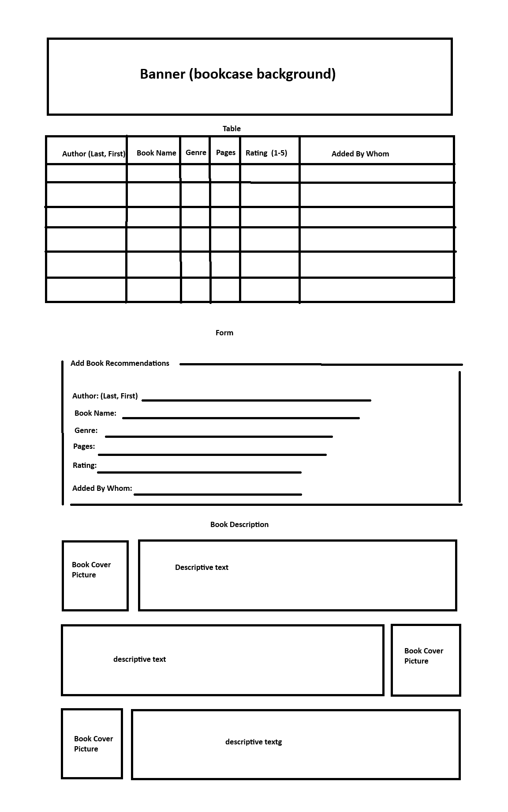

# book_Nook

chart / log and reviews / display

Place for author and other users to log and track books read / are currently reading.  
Add Recommendations.  
Share reviews and/or comments.  
Maybe include voting and chart (big MAYBE).

A = Team Leader Antonio
B = Team Member Antonio
C = Team Supervisor Antonio
D = Consigliere Antonio

## 201_project

### User Stories

As an avid reader; I'd like to keep track of what books I am reading and have read so that I may keep record, provide a rating and review, as well as let other users share books they've read and let them rate and vote (possibly, not concrete detail, yet).

#### Feature Tasks

- Create banner with site title.
- Create table to track books with pertaining info off wireframe.
- Create form to allow additions to table of new books.
  - javascript will add entries to table (if voting is implemented, entries will be included in voting slection).
- Add section to display brief reviews as well as book covers.
- Style (cozy, clean, smooth, professional).
(optional, if time persist...)
- Trigger voting through a button.
  - Voting will display selection of 2 (either or, either retain winner or just randomly shuffle).
  - Display results in chart form (bar or other).

#### Acceptance Tests

- Set up basic HTML layout (sections, divs, header/footer)
- Ensure table displays with static entries.
- Program form to accept input from user about details.
  - Ensure user addition through form entries display in table; table cells (rows & columns) will dynamically add.
    - If voting is added, entries from form also added into the voting selection mix.
- Polish up with styling.
- 

- 03.24.26
  - created index.html, styles.css, app.js, and added .eslintrc.json and reset.css. (A, B, C, D)
    - index with boilerplate. (A)
    - linked css files. (A)
  - folders for css and for imgs. (A)
  - (B) pushed changes.
  - added wireframe img. (B)
  - .
