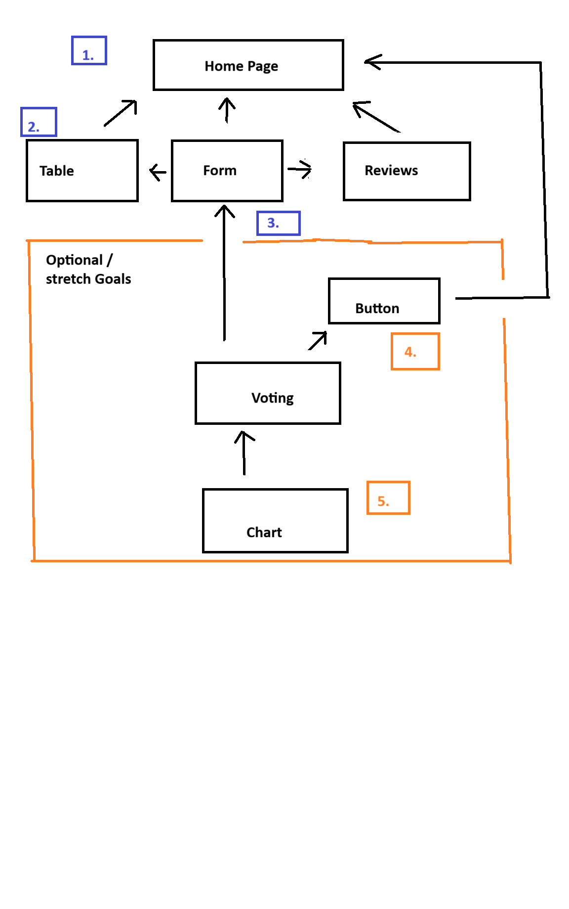

# requirements.md

## Vision

1. What is the vision of this product?
    - The goal is to create a tool for users to track books read and share with others their opinions on the said book, while also receiving recommendations from others as well.

2. What pain point does this project solve?
    - This solves the loss of accountability and tracking where one would ordinarily just picks up a book, read it, and never thinks about it again. Through this tool, users will allow themselves a moment of recollection to reflect on what they just read and share their thoughts with others.

3. Why should we care about your product?
    - This product is marketed to readers, but does not specify what kind of books, or any requirements past that. Books could be fiction, non-fiction, novels, comics, textbooks, biographys, articles/magazines, etc. It is quite literally open for interpretation. Everyone reads, in one form or another, you read even if you say they don't. Audiobooks count and documentaries are also acceptable.

## Scope

- This product will have,
  - a table to display list of books.
  - a form to add new entries.
  - a 'gallery' depicting reviews
  - appropriate styling.
    - (optional)
      - a voting selection of books.
      - a chart displaying results.
- This product will **NOT**,
  - let you read the book on site.
  - tell you where to source the book.
  - how much the book cost.
  - shy from spoilers, per the reviews.

### MVP

- Table
- Form
- Reviews
- Styling

### Stretch

- Voting
- Chart

## Functional Requirements

- Form Entries show up on table.
- Data is persistent on refresh / navigating away.

### Data Flow / Domain Modeling

1. As soon as the user begins to load the app / site,
2. The table, form and review sections will load with static entries (as will the design elements).
3. Once users complete a form entry, the data will be added to the table and the book review section.
4. (Optionally) If voting were to be implemented, the rounds would begin at the press of a button.
5. Once voting is completed, a chart would dsiplay with the results.

